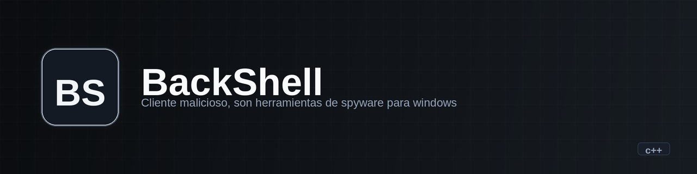

<p align="center">
  
</p>

<h1 align="center">BackShell</h1>

<p align="center"><b>Windows C++ toolkit with three network-connected spyware components: keylogger, reverse shell, and screenshot viewer.</b></p>

<p align="center">
  
  
  
  
</p>

---

## What it is

BackShell is a Windows-only C++ project that builds four executables: an orchestrator (`BackShell`) and three independent components that each open a TCP listener and wait for a remote connection:

- **key_logger** — receives keystroke data over TCP and prints it to stdout.
- **reverse_shell** — provides bidirectional shell communication (read/write) over a TCP socket.
- **window_viewer** — receives JPEG image data over TCP, decodes it with stb_image, and saves each frame as a PNG.

The main orchestrator checks that the three component binaries exist in the working directory, then launches each one in a separate console window via `CreateProcess`.

**In one sentence:** A proof-of-concept Windows spyware toolkit built as a learning exercise in networking and system APIs.

## State

| | |
|---|---|
| **State** | experiment |
| **Last activity** | 2024-08 |
| **Usable today** | no — Windows-only, incomplete cleanup, no server-side components provided |
| **What's missing** | `WSACleanup` calls (noted in code TODOs), thread lifecycle management in reverse_shell, server-side counterparts for all three tools, any form of authentication or encryption |
| **Known debt** | All networking is plaintext TCP. Error handling calls `exit()` on failure. No resource cleanup on normal exit. |

## Why it exists

Educational project exploring Windows socket programming (WinSock2), process creation (`CreateProcess`), and image handling (stb_image). Each component is a standalone exercise in a different system-level task: keystroke capture, bidirectional shell I/O, and remote image reception.

## Demo

No demo available. The project requires a Windows machine and a separate server to connect to.

## Installation and usage

Requirements: Windows, CMake 3.29+, a C++ compiler with C++17 support (Visual Studio / MSVC).

```bash
cmake -B build
cmake --build build
```

This produces four binaries in `build/`:

```bash
# Place all four binaries in the same directory, then run:
./build/BackShell
# It will launch key_logger.exe, reverse_shell.exe, and window_viewer.exe
```

Each component starts a TCP listener on a hardcoded port and blocks until a client connects:

| Component | Port |
|---|---|
| key_logger | 10266 |
| reverse_shell | 28129 |
| window_viewer | 23112 |

## Stack

- **Language:** C++17
- **Build:** CMake 3.29+
- **Platform:** Windows only (Win32 API, WinSock2)
- **Dependencies:** stb_image / stb_image_write (vendored in `src/`)
- **What it doesn't use:** No external networking libraries, no image processing frameworks (OpenCV was removed in favor of stb).

## Architecture

```
BackShell (main)
  ├── key_logger        → TCP listener on :10266 → prints received keystrokes
  ├── reverse_shell     → TCP listener on :28129 → bidirectional shell I/O
  └── window_viewer     → TCP listener on :23112 → receives JPEG, saves as PNG
```

All three components share `connections.hpp` (socket setup) and `errors.hpp` (error-and-exit helper). The main orchestrator is a thin launcher — it does not communicate with the components after spawning them.

## Repo structure

```
src/
  main.cpp              # Orchestrator: checks and launches the three components
  key_logger.cpp        # TCP listener, receives and prints keystrokes
  reverse_shell.cpp     # TCP listener, bidirectional shell communication
  window_viewer.cpp     # TCP listener, receives images and saves as PNG
  connections.hpp       # Shared TCP socket setup (bind, listen, accept)
  errors.hpp            # Error message + exit helper
  stb_image.h           # Vendored stb_image library
  stb_image_write.h     # Vendored stb_image_write library
build/                  # CMake build output (VS project files, binaries)
docs/
  overview.md           # Auto-generated project overview
```

## Roadmap

- [ ] Add `WSACleanup` calls and proper resource cleanup
- [ ] Fix thread lifecycle in reverse_shell (secondary thread continues after main thread error)
- [ ] Add server-side components for each tool
- [ ] Add authentication or at minimum a connection handshake
- [ ] Consider TLS for transport security

## Notes and decisions

- OpenCV was removed in favor of stb_image to reduce build complexity. This was a deliberate simplification — stb is header-only and requires no external libraries.
- All ports are hardcoded via `#define` in each source file. No configuration mechanism exists.
- The `error()` function calls `exit(-1)` after printing, which means no destructors or cleanup runs on failure.

## License

No license file. Without an explicit license, this code is not open source — it is visible.

---

*Documentation prepared from repo inspection. Code was not modified.*
